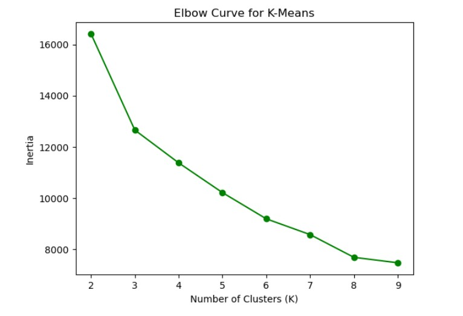
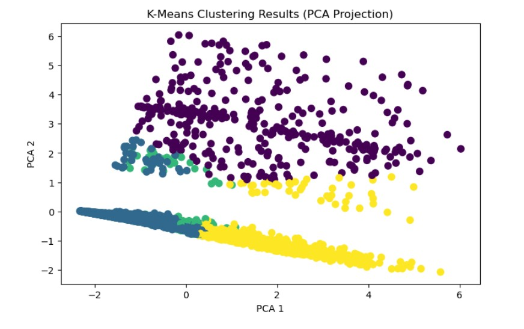
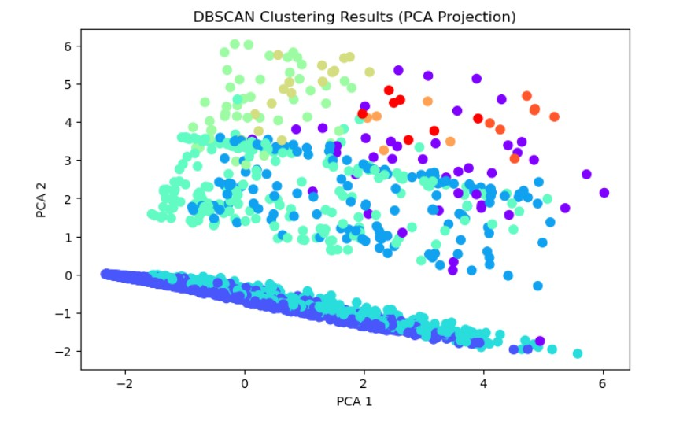

# 🚀 Customer Segmentation using Clustering Algorithms


---

## 📌 Project Overview

This project focuses on **unsupervised learning techniques** to perform customer segmentation using airline data.  
Multiple clustering algorithms such as **K-Means and DBSCAN** are implemented and compared to identify meaningful customer groups.

The goal is to uncover hidden patterns in customer behavior for better business decision-making.

---

## 🎯 Objectives

- Perform clustering on airline customer data  
- Identify optimal number of clusters using **Elbow Method**  
- Apply and compare:
  - K-Means Clustering  
  - DBSCAN Clustering  
- Visualize customer segmentation  
- Derive actionable business insights  

---

## 📊 Dataset

- Dataset: **EastWest Airlines Dataset**
- Contains customer-related features such as:
  - Balance
  - Bonus Miles
  - Flight Miles
  - Transactions
  - Customer activity metrics

---

## ⚙️ Tech Stack

- Python  
- Pandas  
- NumPy  
- Matplotlib  
- Seaborn  
- Scikit-learn  

---

## 🔍 Methodology

### 1. Data Preprocessing
- Handled missing values
- Feature selection
- Data normalization using scaling techniques

### 2. Exploratory Data Analysis (EDA)
- Distribution analysis
- Correlation checks
- Pattern identification

### 3. K-Means Clustering
- Applied K-Means algorithm
- Used **Elbow Method** to determine optimal clusters
- Segmented customers into distinct groups

### 4. DBSCAN Clustering
- Implemented density-based clustering
- Identified noise and outliers
- Compared performance with K-Means

---

## 📈 Results & Insights

- Successfully segmented customers into meaningful clusters  
- Identified different customer behavior patterns  
- DBSCAN helped detect **outliers and noise points**  
- K-Means provided **clear and interpretable clusters**  

👉 These insights can help businesses in:
- Targeted marketing  
- Customer retention strategies  
- Personalized services  

---

## 💡 Key Learnings

- Understanding differences between partition-based and density-based clustering
- Importance of feature scaling in clustering
- How to evaluate clustering performance visually
- Handling real-world unsupervised learning problems

---

## 🔮 Future Enhancements

- Apply Hierarchical Clustering
- Use PCA for dimensionality reduction
- Deploy as an interactive app using Streamlit
- Automate cluster interpretation using AI

## 📸 Visualizations

### 🔹 Elbow Method


### 🔹 Cluster Visualization



---

## 🚀 How to Run the Project

```bash
git clone https://github.com/MeghanaCVarghese/Customer-Segmentation-Clustering.git
cd Customer-Segmentation-Clustering
pip install -r requirements.txt

## Run the notebook:
jupyter notebook notebooks/clustering_analysis.ipynb

---

## 👩‍💻 Author

Meghana C Varghese
Data Scientist | Machine Learning Enthusiast
